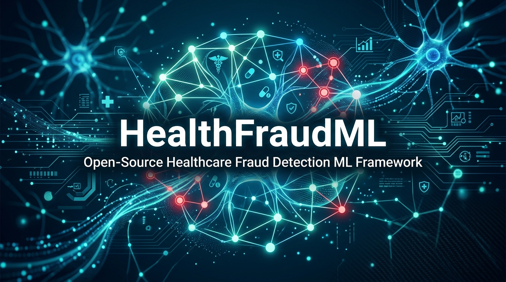

# HealthFraudML — Open-Source Healthcare Fraud Detection Framework



[](https://pypi.org/project/healthfraudml/)
[](https://github.com/bharath309/healthfraudml/stargazers)
[](https://opensource.org/licenses/MIT)
[](https://www.python.org/downloads/)
[](https://github.com/bharath309/healthfraudml/commits/main)
[](https://colab.research.google.com/github/bharath309/healthfraudml/blob/main/examples/healthfraudml_demo.ipynb)

> **Healthcare fraud costs the U.S. over $100 billion annually.** HealthFraudML is a modular Python framework that brings machine learning to the front lines of fraud detection — from claims-level ML models to patient-facing billing audits with auto-generated dispute letters.

---

## What Can It Do?

```python
from healthfraudml import BillingAuditor

# Audit a patient bill for upcoding, unbundling, and price gouging
auditor = BillingAuditor(provider_name="Example Health System")
report = auditor.audit_bill([
    {"cpt_code": "99285", "amount": 6672.00, "description": "ED Visit Level 5"},
    {"cpt_code": "56420", "amount": 709.00, "description": "Bartholin Cyst I&D"},
])

print(f"Risk Level: {report['risk_level']}")           # "High"
print(f"Potential Savings: ${report['suggested_savings']:.2f}")  # "$5,472.00"
print(report['dispute_letter'])                         # Ready-to-send dispute letter
```

**Try it now** → [Open in Google Colab](https://colab.research.google.com/github/bharath309/healthfraudml/blob/main/examples/healthfraudml_demo.ipynb)

---

## Key Features

| Module | What It Does |
|--------|-------------|
| **FraudDetector** | Unified API for 8+ ML algorithms (supervised, unsupervised, hybrid ensemble) |
| **BillingAuditor** | Rule-based CPT code auditing — detects upcoding, unbundling, overpricing |
| **RAGBillAuditor** | RAG pipeline: ChromaDB vector store + Gemini LLM for intelligent auditing |
| **LLMBillParser** | Extract billing data from PDFs and emails using Gemini or regex fallback |
| **CPTDatabase** | Vector-indexed CPT reference database with semantic search |
| **ReadinessAssessment** | Score (0–100) an organization's readiness to adopt ML-based fraud detection |
| **Benchmarking Suite** | Compare models using F1, AUC-PR, MCC — metrics that matter for imbalanced healthcare data |

## Supported Fraud Types

| Fraud Type | Description | Detection Approach |
|-----------|-------------|-------------------|
| Upcoding | Billing for more expensive services than provided | Supervised classification |
| Phantom Billing | Billing for services never rendered | Anomaly detection |
| Duplicate Claims | Submitting the same claim multiple times | Rule-based + ML hybrid |
| Unbundling | Separately billing bundled services | Pattern analysis |
| Identity Theft | Using stolen patient identities | Behavioral profiling |
| Kickbacks | Illegal referral arrangements | Network analysis |

## Installation

### One-click setup (no command line)

For non-technical users auditing bills, grab the file for your OS from
[`install/`](install/) and double-click it:

| OS | File |
|---|---|
| macOS / Linux | [`setup_billaudit.command`](install/setup_billaudit.command) |
| Windows | [`setup_billaudit.bat`](install/setup_billaudit.bat) |

It installs Python if needed, installs the package, creates a `~/BillAudit`
folder with a runner script and a sample bill, then runs a verification audit so
you can see it working. Takes about two minutes.

Afterwards: drop any bill CSV into `~/BillAudit` and double-click `run_audit`
to get a `<name>_report.md` for each one.

> The Windows script has not yet been verified on a physical Windows machine.

### Manual install (pip)

```bash
pip install healthfraudml
```

Or install from source:

```bash
git clone https://github.com/bharath309/healthfraudml.git
cd healthfraudml
pip install -e .
```

## Quick Start — Claims-Level Fraud Detection

```python
from healthfraudml import FraudDetector
from healthfraudml.models import HybridEnsemble
from healthfraudml.preprocessing import ClaimsPreprocessor

# Load and preprocess claims data
preprocessor = ClaimsPreprocessor()
X_train, X_test, y_train, y_test = preprocessor.load_and_split("claims_data.csv")

# Train hybrid ensemble model
detector = FraudDetector(model=HybridEnsemble())
detector.fit(X_train, y_train)

# Detect fraud with explainable outputs
results = detector.predict(X_test, explain=True)

for case in results.flagged:
    print(f"Claim {case.id} | Score: {case.score:.3f} | {case.explanation}")
```

## Quick Start — Patient Billing Audit with RAG

> **Note:** the RAG and LLM features need extra dependencies. Install them with
> `pip install "healthfraudml[rag]"` (adds ChromaDB, Google GenAI, and pypdf).

```python
from healthfraudml import CPTDatabase, RAGBillAuditor

# Initialize vector database with CPT pricing rules
db = CPTDatabase()

# RAG auditor: retrieves rules from ChromaDB → prompts Gemini → generates audit
rag = RAGBillAuditor(db=db)
report = rag.audit_bill([
    {"cpt_code": "99285", "amount": 6500.00, "description": "ED Level 5"},
    {"cpt_code": "",      "amount": 900.00,  "description": "Bartholin cyst drainage"},
], provider_name="Example Health System")

# Semantic search resolves "Bartholin cyst drainage" → CPT 56420 automatically
print(f"Savings: ${report['suggested_savings']:.2f}")
print(report['dispute_letter'])
```

## Organizational Readiness Assessment

```python
from healthfraudml.readiness import ReadinessAssessment

assessment = ReadinessAssessment()
report = assessment.evaluate(
    institution_size="medium",
    annual_claims_volume=120000,
    existing_fraud_detection="manual",
    it_staff_count=5,
    annual_fraud_budget=45000
)

print(f"Readiness Score: {report.readiness_score}/100")
print(report.recommendations)
print(report.implementation_roadmap)
```

## Architecture

```
healthfraudml/
├── detector.py              # Main FraudDetector API
├── models/
│   ├── supervised/          # Neural Net, SVM, Random Forest, Gradient Boosting, Bayesian
│   ├── unsupervised/        # K-Means, Outlier Detection, Artificial Immune Systems
│   └── hybrid/              # AdaBoost Ensemble, Stacked Models
├── preprocessing/           # Claims pipelines, feature engineering, HIPAA privacy
├── evaluation/              # Metrics, benchmarking, SHAP/LIME explainability
├── readiness/               # TAM-based organizational assessment
├── auditor/                 # Patient billing auditor
│   ├── billing_auditor.py   # Rule-based CPT audit engine
│   ├── llm_integration.py   # Gemini LLM parser + RAG auditor
│   └── db.py                # ChromaDB vector store
├── fraud_types/             # Upcoding, phantom billing, unbundling, etc.
└── examples/                # Jupyter notebooks and demo scripts
```

## Research Foundation

Built from doctoral research at the University of the Cumberlands examining ML adoption for healthcare fraud detection across U.S. institutions. Grounded in Technology Acceptance Model (TAM), Fraud Triangle Theory, and Diffusion of Innovations Theory.

**Citation:**
```bibtex
@phdthesis{bahudhoddi2025financial,
  title={Financial Fraud Detection in Healthcare Settings: Comparative Analysis
         through Machine Learning to Identify Problems Relating to Fraudulent
         Activities in Hospitals},
  author={Bahudhoddi, Bharath Kumar},
  year={2025},
  school={University of the Cumberlands}
}
```

## Documentation

Full docs are powered by MkDocs with Material theme:

```bash
pip install mkdocs mkdocs-material
mkdocs serve
# Open http://127.0.0.1:8000/
```

## Contributing

Contributions are welcome! See [CONTRIBUTING.md](CONTRIBUTING.md) for guidelines and [good first issues](https://github.com/bharath309/healthfraudml/labels/good%20first%20issue).

## License

MIT License — see [LICENSE](LICENSE) for details.

## Contact

**Bharath Kumar Bahudhoddi, Ph.D.**
- Email: bharath.p90@gmail.com
